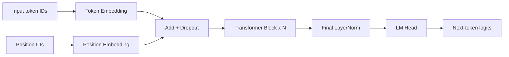
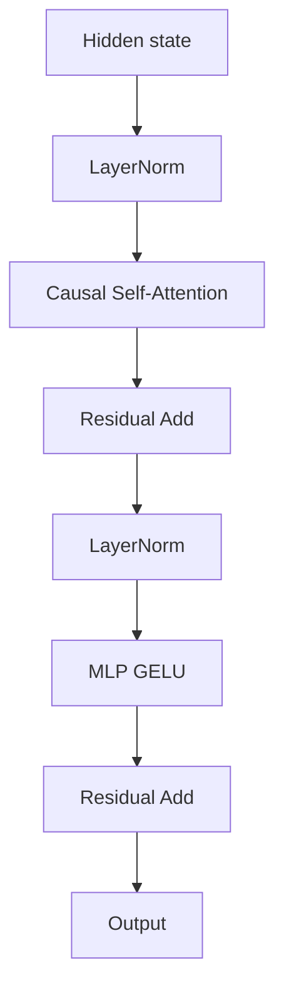
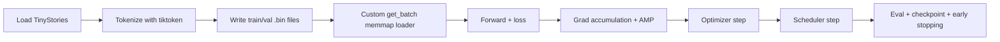
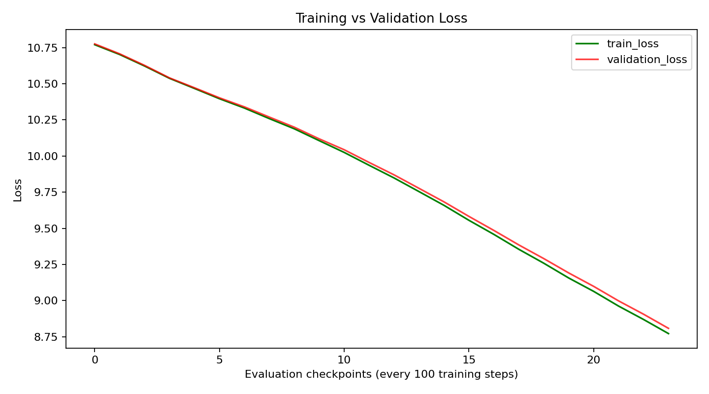

# SLM From Scratch

Ground-up implementation of a GPT-style decoder-only Transformer with custom training pipeline, mixed precision, gradient accumulation, and autoregressive text generation.

## Highlights

- Decoder-only GPT architecture implemented from first principles in PyTorch.
- Custom tokenization + memory-mapped binary dataset pipeline.
- Causal self-attention with Flash attention path when available.
- Stable training setup: warmup + cosine decay, AMP, clipping, checkpointing.
- Verified smoke-run artifact export with metrics and sample generations.

## Architecture Flow

## Transformer Block

## Training Pipeline

## Quick Start

1. Open the notebook at `slm-from-scratch.ipynb`.
2. Ensure your HF token is available via `.env` (`HF_TOKEN=...`) for TinyStories access.
3. Run cells in order from top to bottom.
4. Inspect final artifacts under `artifacts/`.

## Verified Smoke Run (March 23, 2026)

### Configuration

| Parameter | Value |
|---|---|
| Dataset source | TinyStories (`train[:500]`, `validation[:200]`) |
| Layers | 2 |
| Heads | 2 |
| Embedding size | 96 |
| Dropout | 0.2 |
| Max iterations | 2500 |
| Eval interval | 100 |
| Learning rate | 5e-5 |
| Min LR | 1e-5 |
| Batch size | 16 |
| Gradient accumulation | 8 |

### Metrics

| Metric | Value |
|---|---|
| Best validation loss | 8.8081 |
| Last validation loss | 8.8081 |
| Last training loss | 8.7717 |
| Evaluation points | 24 |
| Overfitting flag | false |

## Artifacts

- `artifacts/run_summary.json`: latest run config, metrics, and generations.
- `best_model_params.pt`: best checkpoint from the verified run.
- `artifacts/loss_curve.png`: exported training curve preview.

## Training Curve Preview

  

If the image does not render in your markdown viewer, open it directly: [artifacts/loss_curve.png](./artifacts/loss_curve.png)

## Technical Stack

- PyTorch
- tiktoken
- Hugging Face Datasets
- NumPy
- CUDA + AMP

## Notes

- Scheduler warning fixed: scheduler stepping now occurs only when optimizer stepping occurs under gradient accumulation.
- This repository targets a strong educational/research smoke pipeline, not a production-scale foundation model training system.

## Future Improvements

- RoPE or learned ALiBi positional strategy.
- RMSNorm / SwiGLU variants.
- Fused optimizers and FlashAttention v2.
- DDP/multi-GPU scaling.
